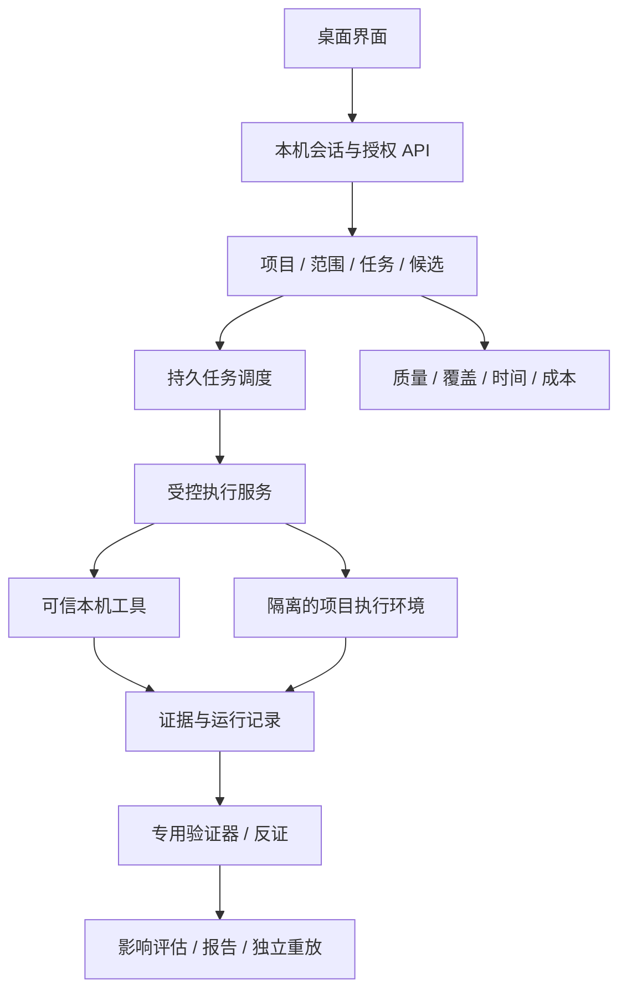

# Fieldwork 完整开发计划

计划版本：1.0 · 2026-09-11  
产品基线：运行时 0.32.1 build 32；个人安全研究桌面工作台  
依据：[综合评估](APPLICATION_ASSESSMENT_2026-09-11.md)、现有代码及 [产品补全历史](PRODUCT_COMPLETION_STATUS.md)  
状态：待执行。本文件是开发和验收计划，不是完成声明；不自动启动定时任务、外部扫描、发布或付费服务。

## 1. 产品目标与完成定义

目标是让个人研究者在一个应用内完成：导入授权目标 → 判断环境是否可测试 → 获取有用线索 → 建立可证伪假设 → 执行适用验证 → 解释实际影响 → 独立重放 → 形成可提交材料 → 修复复测。

产品需要同时满足三个条件：研究者自己的电脑得到保护；输出有可复核的事实依据；换一台干净机器仍能完成核心流程。优先提升真实产出和减少人工整理时间，不以工具数量、页面数量或模型描述长度验收。

### 1.1 发布范围

- 首发支持：macOS Apple Silicon、单用户本地项目、EVM/Solidity/Foundry 主线、HTTP/API 对象授权验证。
- 首发重点 Web3 场景：资产/份额核算、权限边界、受限的回调与重入场景。借贷/预言机随后独立验收。
- 保留并加固现有传统 SRC 编排、证据库、报告及可选 Agent 适配。
- Intel macOS、Windows/Linux 桌面、Solana/Move、多租户云部署分别列为后续兼容项目，不混入首版完成条件。
- 不承诺通用自动审计、必然发现未知漏洞、平台必然接受或赏金收益。

### 1.2 当前基线，禁止混淆

| 已有内容 | 仍须验证/补齐 |
| --- | --- |
| 153 项上一轮软件回归通过 | 真实项目的发现准确率、漏报率、人工成本 |
| AST、入口分析、Forge 两轮属性复测 | 运行时合约绑定、测试正确性、真实经济影响 |
| HTTP 对象权限证明路径 | 更广接口语义、验证器覆盖和身份生命周期 |
| 三类经济正反夹具 | 独立真实协议、部署状态及完整 ERC 标准兼容 |
| 收据、哈希、证据包 | 跨环境语义重放、信任模型与修复确认 |
| 本机桌面可以启动 | 自包含安装、可信更新和干净机器验收 |

正式库评估时为 77 条未验证、14 条归档、0 条正式漏洞。历史数据不自动清理、晋升或用于训练。所有新迁移先备份、试运行并验证恢复。

## 2. 技术结构与边界

保留 Python/FastAPI、现有 Web 前端和 Swift 壳，渐进拆分模块。首阶段不整体重写框架。

- 应用核心不直接散落调用外部进程；逐步收口到执行服务。
- 不可信源码、测试、模板、网页、工具输出和模型输出均作为数据，不能直接获得主机权限。
- 元数据与凭据分开；SQLite 保存引用和脱敏摘要，凭据进入系统凭据库。
- 检测器负责产生观察/候选；验证器负责判断特定假设；影响评估负责解释真实后果。三者不能互相代替。
- “已安装”“可执行”“本轮实际执行”“本轮适用”“有有效结果”分别显示。
- 默认执行限制绑定授权范围、网络出口、资源额度和输出目录；缺少隔离能力时阻止不可信执行，不能自动降级成主机裸跑。

## 3. P0：保护本机与研究数据

本阶段是后续不可信项目执行的依赖，必须优先完成。

| 编号 | 开发任务 | 具体交付与验收 |
| --- | --- | --- |
| SEC-01 | 本地 API 会话鉴权 | 每次启动生成会话凭据，通过受限启动通道交给桌面；不写 URL、普通日志或前端持久存储。所有项目/设置/执行/导出接口统一鉴权，最小健康接口仅给就绪信息。无凭据和旧凭据被拒绝 |
| SEC-02 | Host、Origin 与写操作保护 | 严格校验允许的本机地址和端口；外部 Origin 拒绝；无 Origin 的 CLI 仍需凭据；如采用 Cookie 会话，增加适配本机 WebView 的 CSRF 防护。WebSocket/SSE/下载也纳入策略 |
| SEC-03 | 桌面与后端身份绑定 | 动态端口加每次启动握手；校验实际启动进程和版本；端口预占不能被当作 Fieldwork；外部链接交系统浏览器，WebView 导航限制在本机应用 |
| SEC-04 | 执行服务统一入口 | 替换 Forge 和其他外部命令的直接调用；声明 argv、环境白名单、cwd、输入/输出、超时、资源、网络策略和取消方式；禁止把模型输出直接当 shell |
| SEC-05 | 不可信项目隔离 | 首先限制危险项目配置与可执行编译器来源，同时建立 VM/容器等可验收执行边界；默认不挂载主机用户目录、不继承密钥、不授予任意网络和文件权限；FFI 需求进入独立受限策略 |
| SEC-06 | 输入及文件边界 | 审查 ZIP/路径/符号链接/硬链接/解压大小/压缩比/构建缓存；使用独立源码快照，防止检查后被替换；原始路径与工作副本区分 |
| SEC-07 | 凭据与脱敏 | 系统凭据库保存 API key、会话和 RPC 密钥；数据库只保留 secret_ref；检查日志、异常、导出、备份与子进程环境；轮换后旧引用失效 |
| SEC-08 | 网络出口控制 | 分离目标网络、模型服务、RPC 和工具下载；按连接/重定向校验授权目标；处理 DNS 变化、内网地址和元数据地址。对明确授权的内网目标使用专用策略，不做一刀切 |
| SEC-09 | 前端不可信内容 | 审计 innerHTML、URL、Markdown、工具输出、源码预览；使用文本或白名单净化，补 CSP 与安全下载；恶意标题/证据不能执行脚本 |
| SEC-10 | 威胁模型与安全回归 | 记录不可信项目、恶意网页、本机非特权进程、模型提示注入等边界；不宣称抵抗已控制同一用户账户的恶意软件；加入无害哨兵和拒绝用例 |

验收：无凭据的敏感请求全部拒绝；伪装服务不能被加载；隔离项目不能读取主机哨兵文件/环境或向未授权出口发送请求；归档与日志无测试秘密；安全失败清楚显示，不自动绕过。

Docker 决策：短期把容器作为可用隔离后端；中期支持由应用管理的执行环境，让用户不必手动安装和操作 Docker。是否采用内置轻量 VM，先完成体积、资源、许可、签名和系统兼容性验证。隐藏 Docker 操作与删除隔离是不同事项。

## 4. P1：任务执行、数据一致性与可观测性

| 编号 | 开发任务 | 验收 |
| --- | --- | --- |
| RUN-01 | 持久任务状态机 | queued/running/cancelling/cancelled/succeeded/failed/interrupted 分开；进程退出、应用重启和工具失败不误报完成 |
| RUN-02 | 取消与进程树回收 | 先协作取消、再终止进程组；回收 Fork、临时端口和 worker；取消后不能继续写正式结论 |
| RUN-03 | 资源与输出限额 | 流式收集日志；限定 CPU/内存/磁盘/输出/运行时长/并发；达到限额保留部分证据及明确原因，桌面保持响应 |
| RUN-04 | 幂等与并发 | 重复点击、重试、worker 重启不重复发请求或创建正式漏洞；状态更新用事务及版本检查；不可安全重试步骤保持待处理 |
| RUN-05 | 工具运行清单 | 固定工具、编译器、模板、镜像及配置摘要；保存退出码、耗时、覆盖、降级原因；版本不兼容提前报告 |
| RUN-06 | 迁移与备份恢复 | 数据 schema 与应用版本兼容；迁移前备份并校验；磁盘满/中断/旧版启动有明确行为；在副本上实测恢复 |
| RUN-07 | 分层日志与诊断包 | run/job/candidate 关联 ID；日志轮转、保留周期、脱敏诊断包；默认不上传 |
| RUN-08 | 核心模块拆分 | 从 final_core.py 抽取访问策略、任务、候选、验证、报告服务；以原接口合同保持兼容，不同时重写数据模型和 UI |

完成标准：中断、重启、限额、网络失败、工具缺失、重复请求均有测试；没有孤儿执行进程；数据不损坏；用户能辨认“没发现”“没测完”“无法验证”。

## 5. P1：候选真正走到结论

### 5.1 数据模型

新增或规范化以下对象，先映射现有表，避免重复建同义实体：

- Hypothesis：安全边界、预期行为、实际观察、攻击者权限、适用前置条件、证据引用。
- VerificationPlan：验证器和版本、对象/身份/部署绑定、执行步骤、负对照、预算及授权快照。
- VerificationResult：机器结果、失败原因、反证、环境摘要、原始证据、可重放等级。
- ImpactAssessment：具体资产/用户、成立条件、单位、估算依据、人工判断来源。
- FindingOccurrence：根因、运行历史、受影响版本、修复声明和复测历史。

状态分两轴保存：候选生命周期与本次验证结果。验证运行失败不能等同反证成功；材料缺失不能被自动归档。

建议生命周期：待分诊 → 待材料/可验证 → 验证中 → 待影响确认 → 已确认；另有已排除、重复关联、暂存。修复状态单独维护。

### 5.2 任务

| 编号 | 任务 | 验收 |
| --- | --- | --- |
| CAN-01 | 结构化假设质量门槛 | 页面业务介绍只作为观察；缺安全边界/证据不生成可验证候选；模型置信度不等于成立概率 |
| CAN-02 | 验证器注册表 | 每个方法声明适用类型、前提、所需材料、网络/写权限、负对照、退出状态、可移植等级和正负样本 |
| CAN-03 | 候选工作台 | 左侧队列、中间证据、右侧下一步；可以从候选直达材料补充、计划预览、执行、结果；保留草稿和失败位置 |
| CAN-04 | 计划生成 | 规则先确定方法，模型辅助补建议；所有执行参数经过 schema、Scope 和权限校验；不支持的类型明确保持人工处理 |
| CAN-05 | 去重与优先级 | 同根因跨运行关联，保留原证据；排序依据影响潜力/证据/验证成本并可解释；不把工具重复报告计作多个漏洞 |
| CAN-06 | 历史候选整理 | 对旧记录只生成建议及预览差异；批量操作可撤销并审计，不自动删 77 条旧候选 |
| CAN-07 | 修复确认闭环 | HTTP、Forge 及适用第三方方法逐项补负向复测；验证环境坏了不能认定已修复；原漏洞再次出现自动重开并保留关联 |
| CAN-08 | 用户反馈 | 记录误报原因、缺材料、错误测试、重复、已知问题；用于规则迭代和统计，默认不把私有源码发送训练 |

每个首发验证器必须完成：正例成立、修复例被拒、健康例不误报、前置条件错误得到不确定、证据被篡改被拒、执行中断不晋升。

## 6. P1–P2：传统 Web/API 实战能力

保持 HTTP 对象读取验证为第一条成熟路径，再逐类扩展，不同时承诺全漏洞覆盖。

| 编号 | 任务 | 验收 |
| --- | --- | --- |
| WEB-01 | 有语义的接口导入 | OpenAPI/Postman/HAR 保留方法、路径模板、参数位置、类型、Body schema 和身份引用；秘密不直接导入；多来源显式选择 |
| WEB-02 | 身份工作台 | 两个以上角色、会话有效性、过期/刷新、租户归属、基线资源；凭据仅在执行时解析；匿名与登录失败区分 |
| WEB-03 | 对象权限扩展 | 对象读取成熟后扩展列表过滤、租户边界、功能权限；每类都有独立 Oracle，不能只比较 HTTP 200/响应长度 |
| WEB-04 | 受控请求编辑与重放 | 原始请求、差异、响应与证据绑定；计划展示预计动作；写操作先在本地夹具/测试环境验证，执行权限单独标记 |
| WEB-05 | 流程逻辑模板 | 顺序、重复执行、权益和账本一致性；检查业务状态而非仅网络状态；需要写入的流程具备隔离数据和清理策略 |
| WEB-06 | 常规检测器规范化 | 模板版本锁定、签名来源、强弱匹配区分；XSS/注入/SSRF 等分类型加入可受控验证，不直接信任扫描器标签 |
| WEB-07 | 范围与限速 | 每次请求/重定向强制范围检查，认证刷新出口单独声明；并发与速率可配置；超预算停止且报告覆盖缺口 |
| WEB-08 | OAST 与回调 | 如启用，使用不可猜测的短期关联 token、过期和请求限额；只有合法相关回调进入证据；公开回调端点与管理 API 隔离 |

首版明确支持矩阵：对象读取完整验证；其他类型只有通过对应验收后才显示自动验证。竞态、写入流程及复杂业务逻辑作为后续专用模块，不混同普通只读扫描。

## 7. P1–P3：Web3 从源码线索到真实经济证明

### 7.1 项目与部署一致性

- W3-01：可重建项目快照。固定源码 commit/hash、依赖锁、编译器及构建配置；区分原项目和生成 harness，提供可复核差异。
- W3-02：部署绑定。记录 chain ID、区块号/区块 hash、部署地址、runtime bytecode、代理实现及关键配置；不一致则禁止声称“该部署已验证”。
- W3-03：RPC/Fork 管理。优先只读 RPC，本地 fork 执行；校验链和区块一致性，归档节点不可用明确降级；RPC 凭据不进证据包。
- W3-04：项目规则绑定。版本、到期、受影响资产、影响类别、已知问题和审计来源逐项标记来源与审阅时间；规则合规判断不代替平台裁决。

### 7.2 分析深度

- W3-05：强化 AST 和编译单元一致性，补 inheritance/modifier/library/this/super/重载的正负回归。
- W3-06：调用目标分类。静态候选目标与 fork 实际目标分开；代理、delegatecall、接口调用和虚分派无法解析时保留未知。
- W3-07：状态与资产读写。逐步处理映射、结构体、storage alias 和跨函数依赖；用语义夹具验收，不以解析条数衡量正确性。
- W3-08：运行 trace 对接。把调用栈、事件、余额/债务变化映射回源码与具体交易；区分模拟环境特权和攻击者可用能力。
- W3-09：外部引擎适配。先稳定 Slither/Forge，再验收 Echidna 或其他引擎；保留引擎特有证据，不把不同强度结果粗暴合并。

### 7.3 属性与 fuzz 工作台

- W3-10：协议模板参数化。变量单位、允许误差、舍入方向、资金流和权限前提明确写进属性。
- W3-11：生成 harness 必须展示假设和代码差异；检测永真断言、不可达入口、全部 revert、无目标调用等无效测试。
- W3-12：状态序列 fuzz，记录 seed、深度、成功调用数、revert 比例、覆盖和语料；保存/最小化反例，控制运行预算。
- W3-13：正反对照。漏洞版本、修复版本及健康版本运行同一有效属性；不把更换测试规则当修复成功。
- W3-14：测试特权审查。prank/deal/etch/存储修改等必须记录用途；建立环境与攻击路径分段，不能把无依据的管理员身份当真实攻击者权限。

### 7.4 经济证明首发范围

| 场景 | 必须证明的内容 | 延后条件 |
| --- | --- | --- |
| 资产/份额核算 | 存取资产、总份额、舍入、外部捐赠、攻击者本金和受害者损失；正反版本一致对照 | 非标准代币语义未适配则明确不支持 |
| 权限边界 | 攻击者初始权限、可达动作、未授权结果、正常角色对照 | 依赖管理员失误或外部泄密不能默认为可利用 |
| 回调/重入 | 实际调用序列、状态违反、资产影响和正常回调对照 | 只检测 external call 不能升为漏洞 |
| 借贷/预言机（第二批） | 价格源、时效、抵押/债务、清算阈值、可用流动性及费用 | 无可靠链状态或价格依据不计算统一币种利润 |
| 签名/代理升级（第二批） | chain/domain/nonce/到期/授权者及实现状态的具体绑定 | 静态警告保持候选 |

W3-15 经济证据模型：按资产保存原始整数和 decimals；分别记录本金、注资、借入/归还、余额、债务、费用及受害者变化；没有价格源就不折算美元。Gas 及其他费用无法可靠测量时明确标注。

W3-16 独立重放：在新隔离实例里使用固定快照重新执行最小反例；记录环境差异和依赖缺口。链状态、RPC、工具版本不足时返回不可重放，不伪造成功。

W3-17 报告晋升：可复现属性违反 + 可达攻击者条件 + 有效反证 + 部署/范围一致 + 对应影响依据，才能形成适用的正式结论。单纯 fuzz failed 保持属性失败。

形式化验证列为 P3：先在稳定规格上接入可选引擎并展示假设和未建模部分，不自研通用证明器作为首版前提。

## 8. P1：证据、报告与信任模型

| 编号 | 任务 | 验收 |
| --- | --- | --- |
| EVI-01 | 证据来源记录 | 关联源码/工具/环境/授权/命令/时间和输出哈希；修改材料形成新版本，不能覆盖历史事实 |
| EVI-02 | 收据语义 | 明确收据是受信本地执行的记录，不是第三方公证；保持机器字段与人工影响声明隔离 |
| EVI-03 | 可移植等级 | 分别显示文件完整性、离线记录检查、独立执行重放、部署相关重放；不把低等级包装成高等级 |
| EVI-04 | 包格式版本化 | 清单、内容哈希、依赖、重放合同、限制、脱敏策略和版本；跨版本解析、损坏/遗漏拒绝测试 |
| EVI-05 | 报告质量门槛 | 前提、步骤、预期/实际、影响、反证、修复建议与局限齐全；未测内容明确缺失；不编造严重度/金额 |
| EVI-06 | 导出与复测 | Markdown/JSON/ZIP 优先；SARIF 仅对可映射静态结果输出；模板版本化，修复历史与最新状态一致 |
| EVI-07 | 数据保留与隐私 | 凭据/业务响应/源码分级保留；用户可按项目删除和导出；删除对备份的影响明确；操作留脱敏审计 |

## 9. P1：独立测评与质量体系

### 9.1 数据集

- 首批 20–30 个独立案例作为工程基线，必须包含真实公开修复前后项目、健康负样本、错误环境与不适用输入。
- 按协议/根因分组拆分开发集与留出集，避免同一漏洞变体泄漏；记录来源、许可、版本和真值依据。
- 第二批扩展到 50–100 个分层案例，数量按覆盖和样本可得性调整，不把数量本身当质量。
- 已公开案例可能被模型见过，必须披露；人工审阅者尽可能不看模型结论先标注，分歧保留待裁决。
- 自建夹具继续用于回归，单独报表，不与独立项目结果合并宣传。

### 9.2 指标定义

| 指标 | 定义/注意事项 |
| --- | --- |
| 候选精确率 | 人工确认真阳性 / 已判定候选；未判定数单列 |
| 支持范围内召回率 | 检出的已知漏洞 / 基准中符合声明范围的全部已知漏洞；不能事后删掉难例 |
| 自动完成率 | 无人工改测试或补代码完成的适用案例比例；提供资料的人工时间仍记录 |
| 独立重放率 | 在第二环境复现的正式结论 / 尝试重放的正式结论；未尝试单列 |
| 健康样本误报 | 健康样本被错误确认为漏洞的数量/比例，区分候选误报 |
| 时间和成本 | 首条有效证据时间、总运行时间、人工分钟、模型实际用量/费用、工具资源 |
| 覆盖与失败 | 编译成功、身份有效、代码/入口/属性覆盖、环境失败和不适用率 |

报告样本数、分层结果和置信区间；N=0 显示不适用，不能显示 100%。耗尽预算、构建失败、拒绝执行都计入适用口径的失败解释，不能隐藏。

### 9.3 暂定发布门槛

这些是工程目标，不是已有成绩；首批独立基线后可调整，但调整理由必须留档，不能为通过验收偷偷缩范围。

- 所有关键安全拒绝测试、证据篡改测试及迁移恢复测试通过。
- 所有首发验证器正反合同通过，发布夹具中不得出现健康例错误正式确认。
- 留出集的正式确认精确率目标 ≥95%，独立重放成功率目标 ≥90%；同时报告样本量，小样本达标不能宣传统计保证。
- 首发声明范围召回率目标 ≥70%；各类别独立披露，不能用强项掩盖弱项。
- 发布演练不允许丢失正式记录或出现高风险隔离逃逸；失败不得仅靠提示文案降级。
- 同条件比较基础工具、基础工具+人工、Fieldwork；固定目标版本、时间预算、凭据、模型与人工投入。

## 10. P1–P2：UI 与可用性

| 编号 | 任务 | 验收 |
| --- | --- | --- |
| UX-01 | 统一设计变量 | 中文正文默认 16–17px、辅助信息通常 ≥14px；支持 90%–150% 字体设置；颜色/间距/控件尺寸统一，不再堆叠覆盖 CSS |
| UX-02 | 主任务导航 | 新建、运行、候选、报告、设置各有明确入口；模式切换保留项目上下文，异步结果不能串域 |
| UX-03 | 渐进展示 | 默认呈现结论、证据和下一步；专家参数折叠；技术细节放在可展开诊断区域 |
| UX-04 | 状态和错误 | 失败原因、已完成范围、恢复动作、材料缺口明确；无结果不显示庆祝或安全保证；长任务可取消 |
| UX-05 | 证据阅读器 | 源码定位、HTTP 差异、交易调用树、资产前后表；复制/导出/跳转可用，秘密默认遮蔽 |
| UX-06 | 候选批量处理 | 搜索、筛选、排序、批量预览和撤销；列表虚拟化/分页，编辑草稿不会因刷新丢失 |
| UX-07 | 可访问性 | 键盘焦点、弹窗焦点恢复、屏幕阅读器名称、对比度、200% 缩放；颜色不是唯一状态标识 |
| UX-08 | 多尺寸验收 | 800/1024/1440px 宽度及原生窗口验证；长中文标题、日志、地址不撑坏布局；表格按需独立滚动 |
| UX-09 | 新用户引导 | 首次启动完成环境检查和本地演示；用户清楚知道演示结果不是真实目标漏洞 |

性能初始预算：参考机器与测试数据固定后，普通操作视觉响应目标 <200ms；非执行 API p95 <500ms；千条候选查询/筛选目标 <1s；资源清单用异步加载，不阻塞启动。基线测量后明确硬件、冷/热启动和允许误差。

## 11. P1–P2：桌面与运行时交付

- DESK-01：清除硬编码用户路径；应用资源、用户数据、日志、缓存采用标准目录，项目外置可选。
- DESK-02：打包固定 Python 运行时与后端依赖，保持核心离线启动；外部工具按需安装但不依赖开发者目录。
- DESK-03：工具清单、版本锁定、下载哈希/签名、安装失败恢复和许可清单；区分官方包和用户自定义工具。
- DESK-04：统一 shell/runtime/schema 版本展示；安装后的源文件不再直接读取开发工作区。
- DESK-05：签名、公证和可信更新链；更新包校验、原子切换、失败回滚。正式签名凭据缺失时明确发布阻塞，开发签名不冒充公证。
- DESK-06：应用内管理执行环境，显示磁盘/内存需求、启停和清理；不在下载失败时改用不安全执行。
- DESK-07：首次启动、权限被拒、端口冲突、路径含中文/空格、离线、代理、磁盘不足和升级中断验收。
- DESK-08：干净用户与干净机器验收；复制 App 后可打开、建立演示项目、执行本地样例、导出、重启恢复；完全没有 Anaconda 和开发仓库也可运行。

“都做进程序内”的完成定义是用户在应用内安装/管理能力，而非将所有外部引擎重新实现；大体积运行时允许按需下载，但首次网络需求要明确。

## 12. P2：模型、成本与扩展生态

- AI-01：模型建议只产出结构化候选/计划；输出通过 schema、范围和权限校验。网页或源码中的指令不能改动执行策略。
- AI-02：记录供应商实际 usage；缺失时显示未知或估算，不能冒充实际费用；项目预算、单任务上限、停止与重试成本可见。
- AI-03：模型调用前展示数据类别，按项目选择本地/远端；秘密和完整原始响应默认不发送；缓存按源码/工具/模型/提示版本失效。
- AI-04：上下文检索引用具体源码/证据；生成测试必须进入隔离执行与人工可审阅差异；失败迭代设预算。
- AI-05：Strix/Shannon 等适配固定版本、能力合同和运行边界；单独报告安装/登录/执行/有效结果，升级后跑兼容测试。
- AI-06：适配器 SDK 声明输入、权限、成本、结果 schema、验证等级和正负样例；第三方适配器进入隔离，不默认获得主进程权限。

## 13. 里程碑、依赖与工期假设

工期仅用于安排：假设两名熟悉项目的全职工程师、一名兼职安全测试人员，有可用 macOS 测试设备和模型/RPC 预算。累计约 18–24 周形成范围受限的 1.0 候选；单人执行通常更长。实际排期在第一阶段基线后重估，不按日期强行放行。

| 阶段 | 参考时段 | 交付物 | 放行条件 |
| --- | --- | --- | --- |
| M0 事实与基线 | 第1周 | 最新能力矩阵、威胁模型、架构决策、基准清单 | 旧状态冲突已标注、测量口径固定 |
| M1 安全 Alpha | 第2–4周 | API/桌面身份、执行服务、隔离及资源控制 | SEC 核心拒绝测试通过；不可信项目不能裸跑 |
| M2 可操作研究流程 | 第5–7周 | 持久任务、候选计划、身份及报告改进 | HTTP 正反流程完整；中断恢复和证据合同通过 |
| M3 Web3 首发场景 | 第8–12周 | 项目/部署绑定、属性工作台、三类场景 PoC | 正反项目+独立重放；真实经济条件有来源 |
| M4 独立测评与桌面 Beta | 第13–16周 | 留出评测报告、自包含桌面、兼容矩阵 | 干净机器可运行；结果与失败口径完整披露 |
| M5 1.0 候选 | 第17–20周及缓冲 | 冻结支持矩阵、升级恢复演练、最终验收报告 | 关键安全无未解决项；首发指标和操作流程达标 |
| M6 扩展 | 1.0 后 | 借贷/预言机/签名/代理、更多平台和形式化适配 | 每个新能力独立验收后再标支持 |

依赖：M1 执行隔离 → 不可信 Web3/Agent 执行；M2 证据合同 → M3 正式报告；M3 独立重放 → M4 质量判断。基准准备、UI 设计和打包研究可在逻辑上并行，但本计划不自动创建代理或新任务。

若时间或预算不足，减少首发支持类别；API 保护、隔离、证据真实性和恢复能力不可作为可删功能。

## 14. 第一批可直接进入开发的任务

顺序按安全依赖排列，均在独立数据库/本地夹具验证：

1. 建立当前行为与安全失败基线，保存版本和测试命令。
2. 写出桌面启动会话、端口和 API 鉴权合同。
3. 实现 API 认证及 Host/Origin 拒绝路径，覆盖流式/下载/旧 API。
4. 改造 Swift 启动握手，测试伪装服务和重启凭据失效。
5. 新建受控执行服务，迁移 Forge build/test/replay。
6. 限制 FFI/编译器路径/环境继承，建立隔离执行后端；逐层验证，不能把配置限制当完整沙箱。
7. 加流式日志、输出限额、取消进程树和资源预算。
8. 审计 ZIP、源码快照、导出和前端渲染信任边界。
9. 将任务终态和重启恢复收口，补迁移/恢复测试。
10. 建立验证器合同和候选状态映射，保留旧记录。
11. 完成对象权限一条端到端正反路径与可恢复 UI。
12. 固定第一批独立评测样本，发布首份含失败的基线报告。

第一批完成后，交付开发版本、变更列表、真实测试结果、已知限制、回滚步骤；不能只交截图或“功能已加入”描述。

## 15. 每项任务与发布的统一完成标准

每项工程任务记录：问题、优先级、负责人角色、依赖、涉及模块、数据变更、正反验收、失败行为、证据路径、回滚方式和状态。

- 功能的成功路径、拒绝路径和失败路径均经过适当测试；不为低风险样式变更机械增加单元测试。
- 安全/状态/证据变更必须有回归；UI 变更需要真实交互与目标尺寸验证。
- 测试不写生产数据库，不把 QA 候选混进正式项目，不为验收扫描历史外部目标。
- 跑必要静态检查与模块测试，再按影响执行全量回归；记录跳过项及理由。
- 不把待做项从定义中删掉来宣布完成。新发现缺口进入同一计划并说明对里程碑的影响。
- 发布附能力支持矩阵、指标报告、安装兼容矩阵、已知限制、许可证和恢复说明。

建议新增交付目录：docs/architecture、docs/security、docs/acceptance、benchmarks/independent、tests/security、tests/integration；具体文件位置随渐进重构调整。

## 16. 风险与应对

| 风险 | 应对 |
| --- | --- |
| Fuzz 稳定失败被误解为漏洞 | 检查测试有效性、攻击者条件、负对照与实际影响 |
| 增加很多引擎但有效结果不增长 | 以案例覆盖和每条有效证据成本决定是否保留 |
| 打包隐藏依赖但失去隔离 | 保留独立执行边界，不把无 Docker 当唯一指标 |
| 独立样本太少或被模型见过 | 披露样本和污染风险，扩大留出集，避免行业排名 |
| RPC/模型成本不可控 | 实际用量、限额、缓存、取消和分阶段预算 |
| 老代码与迁移破坏用户数据 | 逐模块替换、备份、兼容读取、副本恢复演练 |
| UI 功能过多再次拥挤 | 主流程优先，专家参数折叠，每阶段进行任务型可用性验收 |
| 许可/签名/设备条件阻碍发布 | 提前列为依赖，不能把开发环境运行当正式发布 |

计划依据中的外部资料链接统一保留在综合评估报告；实施具体引擎和发布流程时重新核查官方文档与版本，不按旧参数盲目接入。
