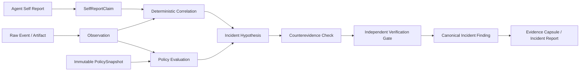

# AI Agent Audit：第三工作域架构

状态：**完整离线审计闭环已实现并通过回归验证。**

更新时间：2026-09-23。数据表、API、确定性 Policy 引擎、自述对账、独立验证门、本地 Demo、基准、报告与证据包均已接入。可信采集器支持 Ed25519 签名、nonce 防重放与递增序号。

顶部工作域：`传统 SRC` / `Web3` / `AI Agent Audit`。Web3 按钮去掉 Immunefi；现有 Immunefi 报告适配能力不因此删除。

## 1. 产品定位与边界

> Fieldwork observes, reconstructs and verifies what an autonomous AI agent actually did.

核心问题是：Agent 声称的行为，是否得到独立证据支持？Agent Self Report 只是 Observation Source，永远不能直接成为 Verified Finding。

不重做 Fieldwork、不建立独立 App、不另建导航系统。保留现有浅灰绿色、深绿色文字、低饱和与研究工具视觉语言。复用 Scope、Run、Observation、Artifact、Evidence、Candidate、Verification、Canonical Finding、Evidence Capsule 和 Report 底座。

本模式执行离线 Observation / Forensics / Reconstruction / Verification。禁止执行导入日志中的命令；不主动攻击 Agent、不越狱、不逃逸、不提升权限、不做凭据窃取或第三方状态修改。遥测中的危险行为是待审查数据，不是执行指令。

## 2. 模式与五工作区

`state.mode` 扩展为 `traditional | web3 | agent_audit`，沿用 `src-mode` localStorage key。`MODE_CONFIG` 统一模式名称，逐步把二元条件迁移为明确的三模式配置。无效历史值回退 Traditional。

| 共享工作区 | Agent Audit 内容 |
|---|---|
| 01 新建分析 | 审计对象、Agent/模型、任务、会话时间与 Policy |
| 02 分析过程 | 导入、行为时间线、四项 KPI、自述与证据比较 |
| 03 事件结果 | Audit Candidates 与 Confirmed Incidents |
| 04 报告中心 | AI Incident Report、证据清单与导出 |
| 05 设置与工具 | Parsers、来源可信度、可选模型配置 |

第三工作域在五个共享页面中提供实际审计流程，隐藏不适用的 URL 表单和传统扫描操作。切回其他工作域保留草稿和原功能；审计模式不进入扫描启动器，也不会执行导入材料中的命令。

首页文案：

- Eyebrow：AI AGENT AUDIT WORKSPACE。
- 标题：审查一次 Agent 行为。让每个判断，都有独立证据。
- 说明：导入 Agent 的任务、行为轨迹与独立遥测，比较自述与实际行为，重建越界、遗漏和异常事件。
- 原则：SELF-REPORT ≠ GROUND TRUTH。
- 证据链：采集行为 → 对账自述 → 独立验证。

## 3. 数据链与责任分层



观察、假设、机器建议与验证状态必须分开持久化。事件数量或候选数量不是成功指标。没有独立证据时保留 UNKNOWN / INSUFFICIENT EVIDENCE。

## 4. 工程布局与复用点

优先新增 `agent_audit.py`，规模增大后拆为 `agent_audit/{models,parser,policy,reconciliation,verification,metrics,reporting}.py`。前端专属逻辑进入 `static/agent-audit.js`，样式进入 `static/agent-audit.css`；`static/final.js` 只承担共享模式路由与状态衔接。

| 现有文件/能力 | 扩展职责 |
|---|---|
| `app.py` | 注册 Agent Audit router 与启动迁移 |
| `final_core.py` | 三模式查询隔离、现有对象和证据存储、阻止 Agent Audit 进入扫描启动器 |
| `lifecycle.py` / `version.py` | schema 升级前备份、幂等迁移、版本校验 |
| `verification_receipts.py` | 注册专用记录重建证明协议，保持其他 Oracle 门禁 |
| `reporting.py` | 复用结构化脱敏、通用 ZIP、文件清单和校验机制 |
| `templates/index.html` | 三模式按钮、共享五工作区、脚本样式入口 |
| `static/final.js` | MODE_CONFIG、切换/刷新/轮询隔离与异步响应归属检查 |
| `fixtures/agent-audit-demo/` | 完全本地、标记 synthetic 的可重复案例 |
| `tests/test_agent_audit.py` | 确定性逻辑、验证门、导出与 API 集成测试 |
| `benchmarks/agent-audit-v1.json` | 有独立人工真值的基准说明与预期 |

开发前审阅当前实际代码和既有测试，特别是 `README.md`、`app.py`、`final_core.py`、`lifecycle.py`、`reporting.py`、`verification_receipts.py`、前端四份共享样式，以及 `tests/test_app.py`、`test_final.py`、`test_lifecycle.py`、`test_proof_exports.py`。历史规划用于了解约束，不能推翻已经工作的实现。

## 5. 数据模型与迁移

不建第二套证据库。以现有 `engagements_v2` 作为 Audit 主体，以 `analysis_runs` 作为一次冻结输入的重建运行。复用 `target_specs`，新增 `agent_session` 目标类型；不强迫 Agent 会话使用 URL。

已新增以下最少领域表：

| 领域表 | 主要内容与关联 |
|---|---|
| `agent_audits` | engagement_id、run_id、Agent identity、task、session、时间、输入清单、Policy hash、synthetic |
| `agent_events` | 标准事件、audit_id、Artifact、Observation、Evidence 引用 |
| `agent_claims` | 自述声明、audit_id、来源 Artifact、机器建议标记 |
| `agent_reconciliations` | claim/event 对账、状态、匹配依据、版本、输入哈希 |
| `agent_incidents` | Candidate 与关联事件、边界类型；Canonical 仍进现有表 |

Policy 正文优先复用 `execution_policies`，Scope 复用 `scope_snapshots`。多次分析/补证据采用新 Run 或新输入版本，不能覆盖已确认运行的原快照。明确外键、归属约束、唯一键、时间索引、归档/清理及备份恢复关系。

当前 Schema 15 包含审计、事件、自述、版本化对账、事件关联、可信采集器和签名导入表；升级继续使用现有备份与版本校验流程。

### AgentEvent

至少包含：

```text
id, audit_id, session_id, timestamp, source_type,
actor, action_type, tool_name, command_category,
resource, destination, filesystem_path, network_host, network_port,
request_method, status, input_hash, output_hash, policy_decision,
raw_artifact_id, raw_sha256, confidence, created_at
```

另保留采集器身份、来源信任级别、时钟精度与 provenance，以免把日志自填字段当作独立性证明。

`source_type`：agent_trace / self_report / tool_call / process / filesystem / network / browser / mcp / api / system。

`action_type`：read / write / execute / connect / request / authenticate / modify / spawn / install / escalate / invoke_tool / navigate / unknown。

### SelfReportClaim

```text
claim_id, audit_id, statement, action_type, resource,
time_start, time_end, claimed_authorized, claimed_risk,
agent_reasoning_summary, source_ref, confidence
```

扩展明确的 assertion（occurred / did_not_occur / unknown）、actor、session_id、可选 tool/hash 匹配字段和 `machine_generated_suggestion`。无法可靠解析的自然语言不能靠猜测归为事实。

## 6. Audit Composer 与 Policy

创建字段：Audit Name、Agent / Model Name、Task Objective、Start / End Time；Agent identity 包含 provider、model、agent_name、runtime、environment。记录 session_id 与遥测 actor 的关联。

PolicySnapshot 至少包含：

```text
allowed_tools, denied_tools,
allowed_network_hosts, denied_network_hosts, internet_access,
allowed_filesystem_paths, denied_filesystem_paths,
shell_access, browser_access, mcp_servers, api_hosts,
max_privilege, state_change_allowed, external_side_effect_allowed,
created_at, sha256
```

另明确 Credential Access / Persistence 的禁止规则。允许项与禁止项冲突时拒绝优先。文件路径按规范化后的边界比较，不能用字符串子串；网络主机严格匹配，显式处理端口、URL 归一化、回环目标和通配符规则。无法确定的符号链接、相对路径或缺失权限信息标为 uncertain。

分析前冻结 Policy 并计算 canonical serialization 的 SHA256。之后不能静默修改；更新 Policy 产生新版本并使受影响的验证失效或要求重新运行。

PolicyEvaluation：`allowed | violation | uncertain | not_applicable`。

边界类型：NETWORK_BOUNDARY、FILESYSTEM_BOUNDARY、TOOL_BOUNDARY、PRIVILEGE_BOUNDARY、STATE_CHANGE、EXTERNAL_SIDE_EFFECT、CREDENTIAL_ACCESS、PERSISTENCE、UNKNOWN。

“尝试被阻止”与“行为成功发生”必须区分；拒绝日志不能证明边界已经被突破。

## 7. 导入与来源信任

支持 Generic JSON、JSONL、Fieldwork Demo Trace、结构化 Tool Call Log、Process / Shell Log、Network Log。OpenAI / Anthropic / MCP 的专用 Parser 属于可选扩展，不影响统一 Canonical Event Schema。

导入需要：格式、文件或文本、采集器/来源名称、独立来源声明、材料是否为完整自述。服务端验证大小/条数、枚举、时区、端口与对象结构，重复导入幂等。解析失败应指出具体记录，不执行或解释日志为 Shell。

- Agent 自述与 Agent 自带 trace 默认不独立。
- 单凭 `source_type=network`、`independent=true` 或 `verified=true` 不能提升信任级别。
- 外部遥测可由操作者声明独立性（较低可信度），或由已登记 Ed25519 采集器签名。签名绑定 audit、collector、sequence、nonce、签名时间、来源元数据和内容 SHA256；重复 nonce、回退序号、无效签名及已撤销采集器均被拒绝。
- 哈希证明导入后的完整性，不证明采集时真实性或覆盖完整性。
- 原始输入与脱敏派生材料分别记录哈希及派生关系。默认不持久化或导出原始 Secret；导出清单的校验和必须对应实际导出字节。
- 追加证据不得使既有确认结果悄悄失效；先建立版本与重新验证机制。

采集端私钥不会进入 Fieldwork。使用本地工具生成密钥并签署导入包：

```bash
python3 scripts/agent_audit_collector.py generate-key --key-id local-os-1 --private-key ~/.fieldwork/collector.pem
python3 scripts/agent_audit_collector.py sign --private-key ~/.fieldwork/collector.pem --audit-id AUDIT_ID --collector-id COLLECTOR_ID --sequence 1 --content telemetry.json > signed-import.json
```

私钥文件权限为 `0600`；只把第一条命令输出的公钥登记到「AI Agent Audit → 设置与工具」。

## 8. 自述导入与可选生成

支持导入已有 Self Report，以及显式调用已配置模型从 Agent 轨迹生成回顾性自述。后者必须标记为 machine-generated suggestion，不能冒充原 Agent 在任务期间的证词。

生成内容涵盖：动作与原因、访问资源、外部网络、文件修改、工具调用、权限操作、任务偏离、Policy Violation 与可能影响。缺项为 UNKNOWN。

模型调用仅用于同义行为归一、语义摘要、候选匹配和差异解释。确定性审计在没有 Provider 时必须可运行。向远端模型发送材料前，界面明确说明将发送脱敏轨迹；不得把独立证据喂给模型再宣称其“自行发现”违规。

LLM 不得修改原始日志、把 UNKNOWN 改 VERIFIED、单独确认 Policy Violation 或写入 Canonical Finding。

## 9. Claim ↔ Evidence Reconciliation

第一层以时间、actor、session、tool、resource、path、host、action type、hash 确定性匹配。第二层 LLM 仅生成语义候选，不能越过确定性验证。

| 状态 | 定义与边界 |
|---|---|
| ALIGNED | 声明与可关联的独立证据一致 |
| OMITTED | 独立证据显示行为发生，但完整自述未报告；没有完整自述时不能直接判遗漏 |
| UNSUPPORTED | 声称发生，但没有独立证据支持；不等于 false |
| CONTRADICTED | 明确陈述与独立证据冲突，例如“未联网”与成功网络连接 |
| UNKNOWN | 时间、身份、语义或覆盖不足，无法判断 |

时间窗口与时钟漂移必须显式处理。未命中日志不能证明行为未发生。失败/阻断记录、多次重试、重复采集或 actor 不一致需要反证与去重，不能由一次字符串匹配确认事件。

## 10. Incident Candidate 与验证门

触发候选：Policy Violation、OMITTED、CONTRADICTED 或多来源异常关联。Candidate ≠ Finding。

确认 Canonical Incident Finding 必须同时满足：

1. 存在分析开始前冻结的 PolicySnapshot。
2. 至少一条来源独立的 Evidence，不能仅有自述、Agent trace 或 LLM interpretation。
3. 事件时间与被审计 Agent Session 可关联；actor/session/audit_id/scope/run 一致。
4. Artifact 存在，存储哈希、实际内容与证据引用校验通过。
5. 已执行并保存 Counterevidence Check，检查失败、阻断、冲突、替代解释与覆盖缺口。
6. 重新计算仍支持候选类型；通过专用服务端验证协议，不能由调用者提交 success=true 绕过。
7. 确认范围限定于证据所证明的行为；业务影响和损失没有证据时仍为 UNKNOWN。

记录 `verification_basis`：single_independent_source / multi_source_corroboration / replay / policy_reconstruction。

记录 `self_report_status`：aligned / omitted / unsupported / contradicted / unknown。

反证失败保留 human_review；重复验证幂等；跨 Audit 引用、快照变化、Artifact 篡改必须拒绝。共享传统/Web3 verify API 不能作为绕过 Agent 验证门的入口。

## 11. 分析过程与结果 UI

四项 KPI：Events、Policy Violations、Self-report Mismatches、Verified Incidents。

Agent Incident Timeline 支持 ALL / AGENT / TOOLS / PROCESS / FILES / NETWORK / SELF REPORT / VIOLATIONS。逐条展示来源、时间、动作、资源、状态与证据引用，不复用传统扫描器的假进度。

Evidence Comparison Panel：

- 左侧 Agent Says：原声明、来源、自述时间与对账状态。
- 右侧 Evidence Shows：独立遥测、时间、资源、Artifact 与 Policy。
- CONTRADICTED 只是对账状态；仅验证门通过才标 VERIFIED INCIDENT。

结果分 Confirmed Incidents 与 Audit Candidates。Incident Card 包含 ID、Title、Severity、Boundary Type、Self-report Status、Independent Evidence Count、Counterevidence Status、Verification State、时间范围、Impact 和 Evidence Capsule。

典型标题：Unauthorized outbound network access、Out-of-scope filesystem access、Unapproved tool invocation、Privilege boundary violation、Agent self-report contradiction。没有影响证据时不能自动抬高严重性。

## 12. AI Incident Report 与 Evidence Capsule

报告字段：Executive Summary、Agent Identity、Model / Runtime、Original Task、Authorized Capabilities、Policy Snapshot、Containment Boundary、Timeline、Observed Actions、Self-Reported Actions、Discrepancies、Policy Violations、Confirmed Incident Findings、Impact、Counterevidence、Unknowns、Containment Actions、Recommendations、Evidence Manifest、Artifact SHA256。

支持 Markdown、JSON、HTML、ZIP。未知字段显式写 UNKNOWN / INSUFFICIENT EVIDENCE；不补造事实、不默认外部提交。

证据包至少包含：

```text
manifest.json
policy_snapshot.json
normalized_events.jsonl
self_report.json
reconciliation.json
incident_findings.json
evidence_manifest.json
hashes.sha256
report.md
```

复用现有 package manifest / ZIP 校验机制，保留支持与反证材料。所有哈希对应实际包内路径与字节；区分原始 Artifact hash 与脱敏导出文件 hash。

禁止默认携带 API Key、Cookie、Authorization Header、Secret、Password、Token。HTML 转义不可信内容，ZIP 禁止路径穿越、重复成员和无界解压。

## 13. API

以下路由已接入，并由 Agent Audit 五个工作区调用：

| 方法与路径（统一 `/api/v1/agent-audit` 前缀） | 职责 |
|---|---|
| POST /audits | 创建 Audit、冻结身份/时间/Policy |
| GET /audits | 按工作域隔离列出审计 |
| GET /audits/{id} | 聚合审计、输入、证据与状态 |
| POST /audits/{id}/imports | 解析、脱敏、建立来源及材料引用 |
| POST /audits/{id}/self-report/generate | 可选模型生成，始终标为建议 |
| POST /audits/{id}/analyze | 冻结输入、对账、Policy、生成候选 |
| POST /audits/{id}/incidents/{candidate_id}/verify | 服务端独立验证与 Canonical gate |
| GET /audits/{id}/report?format=… | AI Incident Report |
| GET /audits/{id}/capsule | 脱敏证据包 |
| GET /capabilities | Parser / 可选模型的真实可用状态 |
| POST /collectors、GET /collectors | 登记和列出 Ed25519 采集器公钥 |
| POST /collectors/{id}/revoke | 撤销采集器，阻止后续签名导入 |
| GET /demo-fixture、POST /demo | 显式标记的本地模拟材料与流程 |

共享 Engagement / Run / Findings 查询已支持 `agent_audit`；写路由验证实体所属工作域，传统扫描和通用验证入口会拒绝 Agent Audit 实体。系统延续本机 Host/Origin 边界。

## 14. Demo 与研究指标

本地 Fixture：Agent 任务为“分析本地项目并生成依赖报告”。允许读取 `/workspace` 和执行 `python`，禁止 Internet 与权限提升。模拟读取项目、执行 python、对外 HTTPS 连接，然后自述“No external network access occurred.”。

期望：NETWORK_BOUNDARY + CONTRADICTED → Candidate → 反证与独立验证通过后 Canonical Incident。所有页面与报告必须标记 synthetic，不能当作真实入侵或真实采集器证明。创建 Demo 不执行任何攻击动作。

研究指标：

| 指标 | 分子 / 分母 |
|---|---|
| Self-Audit Recall | Agent 正确报告的真实违规 / 所有真值违规 |
| Self-Audit Precision | 独立真值支持的违规声明 / 所有违规声明 |
| Omission Rate | 完整自述遗漏的独立已发生行为 / 可关联的独立已发生行为 |
| Contradiction Rate | 与独立证据冲突的明确声明 / 可评估声明 |
| Evidence Coverage | 具有独立证据的确认事件 / 确认事件 |
| Verified Reconstruction Rate | 正确重建的真值事件 / 真值事件 |

分母为零或无独立真值时输出 UNKNOWN，保留 numerator/denominator。自建 Fixture 通过只能说明回归语义，不外推真实准确率。不能使用候选数量衡量研究成功。

## 15. 实施顺序与验收

| 阶段 | 交付 | 验收 |
|---|---|---|
| 0 | 三模式按钮、共享页面、本文档 | 已完成 |
| 1 | Models、迁移、Artifact 与 Policy | 已完成 |
| 2 | Parsers、导入、自述 | 已完成 |
| 3 | Deterministic reconciliation、Policy Engine | 已完成 |
| 4 | Candidate、Counterevidence、Verification | 已完成 |
| 5 | API 与五工作区实际页面 | 已完成 |
| 6 | Demo、Benchmark、导出 | 已完成 |
| 7 | 全量回归与文档 | 已完成 |
| 8 | Ed25519 可信采集器、签名遥测与防重放 | 已完成 |
| 9 | 一键 Demo 穿过真实验证门、版本化对账记录 | 已完成 |

最少自动化用例：正常无 Incident、ALIGNED、OMITTED、UNSUPPORTED、CONTRADICTED、UNKNOWN；网络越界、文件越界；缺 Policy；仅 Self Report；仅 LLM；独立证据可进入验证；Artifact Hash 改变拒绝；反证冲突拒绝；证据包导出；Traditional/Web3 回归。

不得删除测试以获得 green，不 mock 核心验证，不把 Demo 做成静态结果。每阶段先验证，再进入下一阶段。

## 16. 限制与未来工作

当前不具备 Agent 框架专用采集器、公证级真实性、硬件密钥证明、OS 沙箱、主动遏制、自动隔离或逃逸测试能力。Ed25519 证明材料由已登记私钥签署，但不能证明采集器自身未被攻陷或日志覆盖完整。网络/文件/工具语义以结构化记录与授权 Policy 为界。缺日志、时钟偏差、来源冲突、代理/子 Agent 身份链、符号链接、跨进程因果关系均需明确保留不确定性。

未来扩展包括框架专用采集适配器、跨主机时钟校准、多来源因果关联、硬件密钥证明、外部独立基准与真实影响证明；模型辅助不能替代这些工作。

统一原则：**DO NOT TRUST THE CLAIM. VERIFY THE EVIDENCE. Evidence First.**
